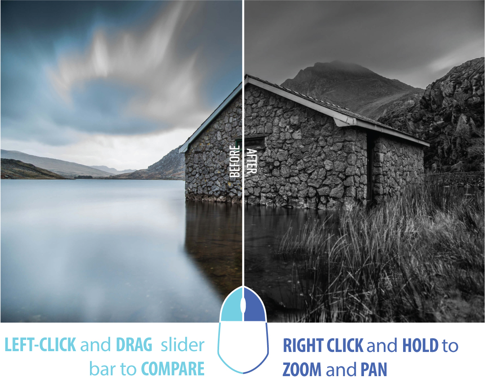

# Contraster
A before and after slider with zoom and pan functionality using [Cocoen](https://github.com/koenoe/cocoen).

## Usage


In the cocoen-container ```<div>```, include the ```data-scale="x"``` attribute and specify the desired zoom distance. Each attribute is uinique to the current element.
```html
<div class="cocoen" data-scale="2">
  
  
</div>
```
## Mobile Controls
TAP and DRAG slider bar to compare.  DOUBLE TAP and DRAG to zoom and pan image.

# License
The code and the documentation are released under the [MIT License](LICENSE).
